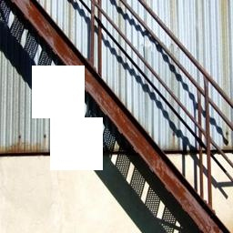
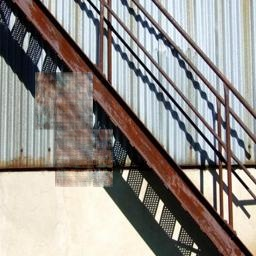
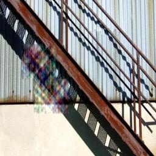
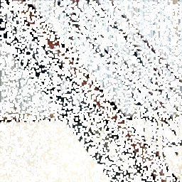
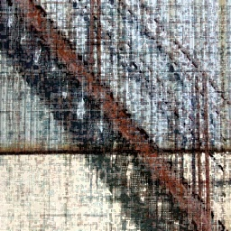
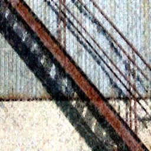

# ConvexOptimImageInpainting
Image inpainting using matrix completion and compressive sensing in fourier domain.

## Files
*main.py*
:  driver code for running experiments

*image_process.py*
:  methods for reading, saving, displaying images, and creating masks

*co_utils.py*
:  algorithms shared by various convex optimization algorithms, e.g., fista

*fourier.py*
:  compressive sensing algorithm for image inpainting using DCT

*matrix_completion.py*
:  matrix completion algorithm for image inpainting

## Demo
Image 4 with p:0.1, nh:2 (masked, mc, fo)
  

Image 4 with p:0.9, nh:10000 (masked, mc, fo)
  
